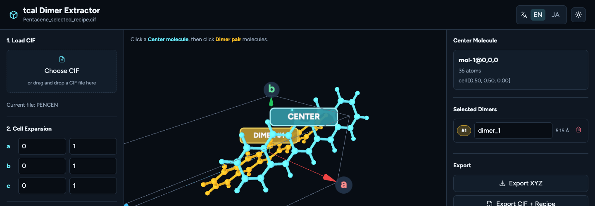

# tcal Dimer Extractor

Live site: <https://youthesame.github.io/tcal-dimer-extractor/>



tcal Dimer Extractor is a browser-based tool for preparing molecular dimer
structures from crystal structure CIF files. It lets users load a CIF file,
expand the unit cell visually, choose one center molecule, select surrounding
dimer-pair molecules in a 3D viewer, and export XYZ files for tcal workflows.

The app is designed to run as a static GitHub Pages site. CIF files are handled
in the browser, so normal use does not require a backend server.

## Why This Exists

tcal calculations often require carefully selected dimer geometries from an
organic molecular crystal. Preparing those dimers by hand is repetitive and
error-prone, especially when molecules cross periodic boundaries or when the
same selection needs to be reproduced later.

This project focuses on the preparation step:

- Load a crystal structure from a CIF file.
- Expand the displayed crystal cell interactively.
- Select a center molecule directly in 3D.
- Select one or more dimer-pair molecules around the center molecule.
- Assign clear labels such as `dimer_1`, `dimer_2`, and `dimer_3`.
- Export center-first XYZ files for tcal input.
- Save a reproducible recipe together with the source CIF.

It does not run tcal itself.

## Main Workflow

1. Open the web app.
2. Drag and drop a `.cif` file into the CIF input area, or choose it from the
   file picker.
3. Adjust the cell expansion ranges for the `a`, `b`, and `c` crystal axes.
4. Click one molecule in the 3D viewer to set it as the center molecule.
5. Click surrounding molecules to create dimer pairs.
6. Rename dimer labels if needed.
7. Export the selected dimers as XYZ files, or export a ZIP bundle with XYZ
   files and a reproducibility recipe.

## Exported Files

The app can export:

- `*.xyz`: one selected dimer per file, with center-molecule atoms first and
  dimer-pair atoms second.
- `*_tcal_recipe.cif`: the original CIF with an embedded tcal Dimer Extractor
  recipe block.
- `*_tcal_dimers.zip`: a bundle containing all selected XYZ files and the
  recipe-embedded CIF.

The recipe records the source structure hash, cell expansion range, center
molecule, selected dimer molecules, labels, and atom ordering rule. Loading a
recipe-embedded CIF restores the previous selection when the referenced
molecules are available.

## Features

- Browser-only CIF parsing and dimer extraction.
- 3D molecule picking with strict click detection.
- Periodic-boundary-aware molecule reconstruction for organic molecular
  crystals.
- Interactive cell expansion along the `a`, `b`, and `c` axes.
- Clear visual distinction between the center molecule and selected dimer
  pairs.
- Dark mode by default, with light mode toggle.
- English and Japanese UI toggle.
- Reproducible export through CIF-embedded recipe data.

## Development

Install dependencies:

```bash
pnpm install
```

Start the development server:

```bash
pnpm dev
```

Run tests:

```bash
pnpm test
```

Build the static site:

```bash
pnpm build
```

Preview the production build locally:

```bash
pnpm preview
```

## References

- tcal: <https://github.com/matsui-lab-yamagata/tcal>
